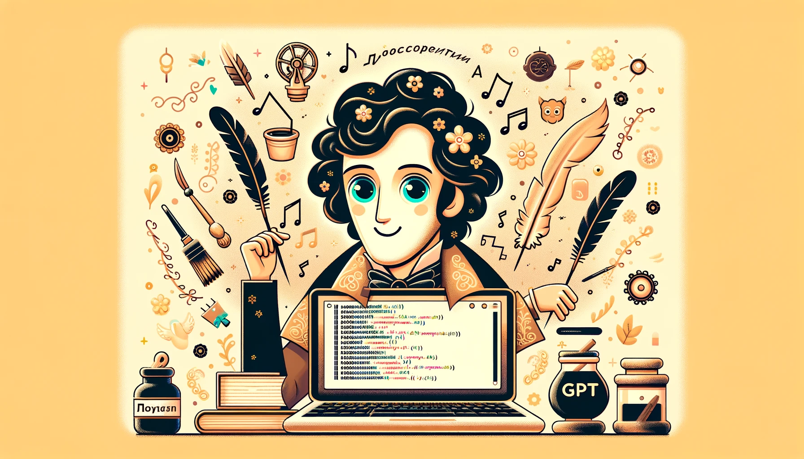

# RuPoemGPT



RuPoemGPT is a character-level language model trained on a collection of russian poems. It is based on the original [nanoGPT](https://github.com/karpathy/nanoGPT) 
project by Andrej Karpathy. The core difference lies in the dataset, the model was trained on - the collection of russian poems was used. This project is particularly beneficial for those interested in natural language processing and serves as a practical platform for exploring text generation.

### Dataset

The datasets are located in the `data` folder. Particulary the `data/data.txt` file contains the collection of russian poems. The dataset was collected from the [poetryclub](https://www.stihi.ru/) website. The dataset contains 165 unique characters. The dataset was preprocessed and cleaned before training.

An alternative dataset is located in the `data/pushkin_stihi2.txt` file. It contains the collection of poems by Alexander Pushkin. It was preprocessed and cleaned before training as well. The only disadvantage of this dataset is that it is too small for training a good model.

### Installation

RuPoemGPT requires [Python](https://www.python.org/) 3.10+ to run.
To install dependencies and prepare proper virtual environment, follow instructions
from the directory above.

The core files are Jupyter notebooks, `model.py`, `train.py` and `run.py`. The `train.py` file is used for training the model. The `run.py` file is used for generating text from the model. The `model.py` file contains the model architecture.

In the Jupyter notebooks, you can find the worflow, which was used to train the model. 

### Example Usage

To generate text from the model, run the `run.py` script. Pay attention, that hyperparameters are hardcoded in the script. If you want to change them, you need to change them in the script itself. The `run.py` script will load the model from the `model` folder and generate text from it. The generated text won't be saved.

**Example:**

```sh
(ml-random) gromdimon@Dzmitrys-MacBook-Air pushgpt % python3 run.py
Loading model...
Config: vocab_size=165 batch_size=32 block_size=64 max_iters=6000 eval_interval=100 learning_rate=0.001 device='cpu' eval_iters=200 n_embd=64 n_head=8 n_layer=8 dropout=0.0
Model loaded in 0.08s
	Рато таинслие,
Завес прошла, я, обирать.

Судьба одемно того,
И сердце б болезним моим своевом?
...
...
Generation completed in 14.09s
```

To train the model, run the `train.py` script. Pay attention, that hyperparameters are hardcoded in the script as well. For proper training please change the hyperparameters and the data source itself. While the training some checkpoints will be saved in `model` folder. The checkpoints will be saved every 2000 iterations.

**Example:**
```sh
(ml-random) gromdimon@Dzmitrys-MacBook-Air pushgpt % python3 train.py
0.423845 M parameters
Data loaded in 0.37s
Config: vocab_size=165 batch_size=32 block_size=64 max_iters=6000 eval_interval=100 learning_rate=0.001 device='cpu' eval_iters=200 n_embd=64 n_head=8 n_layer=8 dropout=0.0
Training started...
step 0: train loss 5.2604, val loss 5.2615
Iteration 0 completed in 14.95s
step 100: train loss 2.8156, val loss 2.7968
step 200: train loss 2.6828, val loss 2.6743
step 300: train loss 2.6191, val loss 2.6073
step 400: train loss 2.5679, val loss 2.5474
step 500: train loss 2.5202, val loss 2.5032
step 600: train loss 2.4764, val loss 2.4627
step 700: train loss 2.4259, val loss 2.4117
step 800: train loss 2.3789, val loss 2.3715
step 900: train loss 2.3309, val loss 2.3221
step 1000: train loss 2.2853, val loss 2.2777
step 1100: train loss 2.2517, val loss 2.2353
step 1200: train loss 2.1999, val loss 2.1923
step 1300: train loss 2.1567, val loss 2.1511
step 1400: train loss 2.1300, val loss 2.1328
step 1500: train loss 2.1104, val loss 2.1155
step 1600: train loss 2.0869, val loss 2.0879
step 1700: train loss 2.0511, val loss 2.0567
step 1800: train loss 2.0356, val loss 2.0503
step 1900: train loss 2.0190, val loss 2.0306
step 2000: train loss 1.9988, val loss 2.0071
Iteration 2000 completed in 513.95s
```

### License

MIT

---

Note: This project was made just for learning purposes. It is not intended to be used for any other purpose. All credit goes to Andrej Karpathy for the original makemore project.
